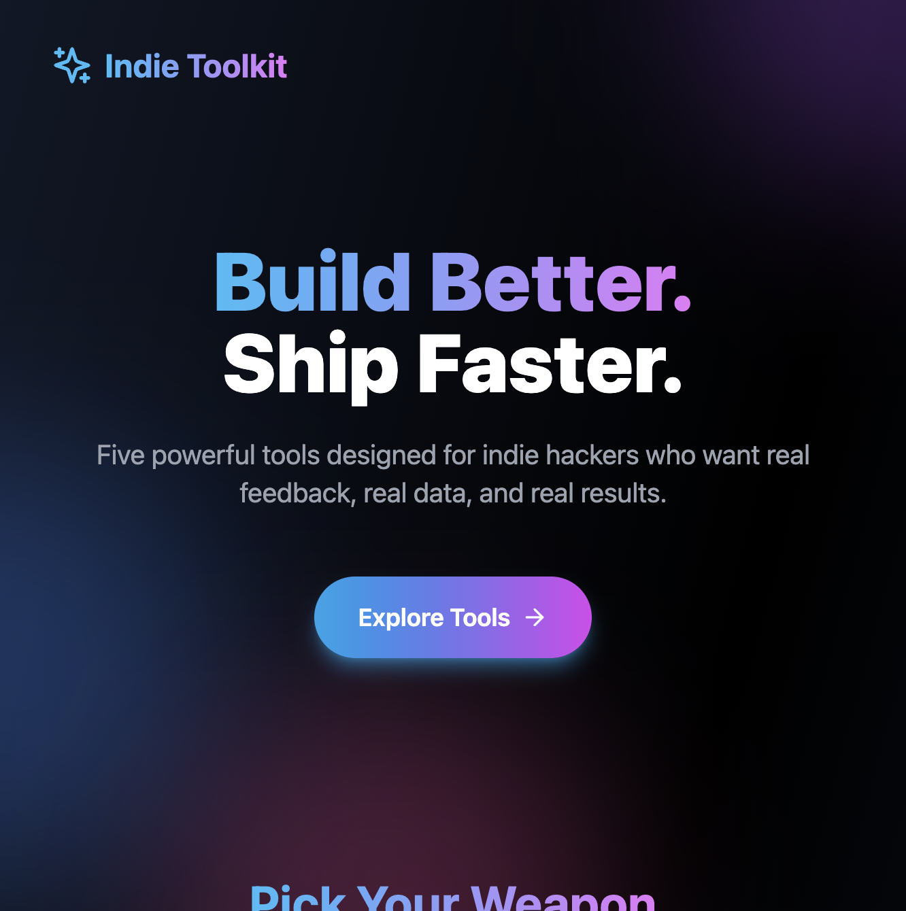
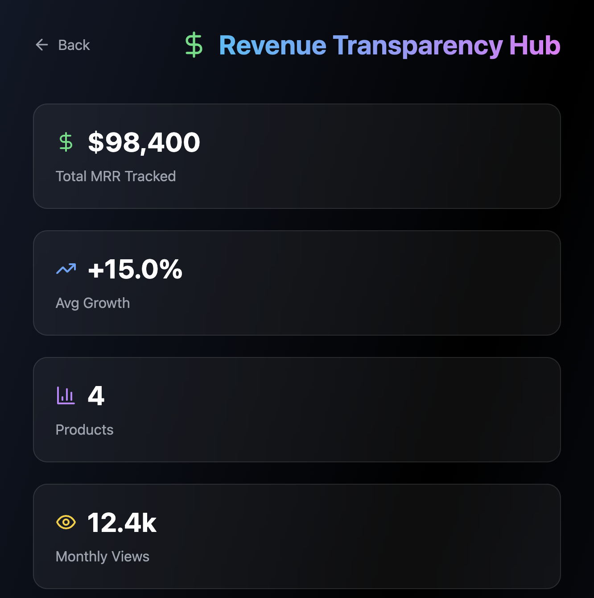

# 🚀 Indie Hacker Toolkit

Five powerful tools designed for indie hackers who want real feedback, real data, and real results.



## 🎯 Overview

A collection of community-driven tools built specifically for indie hackers, founders, and solo builders. Each tool solves a real problem faced by the indie hacker community.

## 🛠️ Tools

### 1. [Brutal Feedback Exchange](./app/brutal-feedback)
Get honest, direct feedback from fellow builders. No sugar-coating, just real critiques.


### 2. [Ship It or Kill It](./app/ship-or-kill)
Let the community decide if your idea is worth building. Validate before you code.


### 3. [Public Building Tracker](./app/building-tracker)
Track your daily progress, build in public, and stay accountable to the community.


### 4. [Revenue Transparency Hub](./app/revenue-hub)
Real revenue numbers from real indie products. Learn from actual data, not vanity metrics.



### 5. [Copy the Playbook](./app/copy-playbook)
Reverse-engineer successful indie products. Learn how they were built, step by step.


## 🎨 Design Features

- **Modern Dark Theme** - Easy on the eyes, perfect for long coding sessions
- **Glassmorphism UI** - Beautiful frosted glass effects with backdrop blur
- **Smooth Animations** - Powered by Framer Motion for delightful interactions
- **Responsive Design** - Works perfectly on desktop, tablet, and mobile
- **Gradient Accents** - Each tool has its own unique color scheme

## 🚀 Tech Stack

- **Framework:** Next.js 14 (App Router)
- **Language:** TypeScript
- **Styling:** Tailwind CSS
- **Animations:** Framer Motion
- **State Management:** Zustand
- **Icons:** Lucide React

## 📦 Getting Started

### Prerequisites

- Node.js 18+ 
- npm or yarn

### Installation

```bash
# Clone the repository
git clone https://github.com/yourusername/indie-hacker-toolkit.git

# Navigate to the project
cd indie-hacker-toolkit

# Install dependencies
npm install

# Run development server
npm run dev
```

Open [http://localhost:3000](http://localhost:3000) to see the app.

### Build for Production

```bash
# Build the project
npm run build

# Start production server
npm start
```

## 📁 Project Structure

```
indie-hacker-toolkit/
├── app/
│   ├── brutal-feedback/     # Brutal Feedback Exchange tool
│   ├── ship-or-kill/        # Ship It or Kill It validator
│   ├── building-tracker/    # Public Building Tracker
│   ├── revenue-hub/         # Revenue Transparency Hub
│   ├── copy-playbook/       # Copy the Playbook
│   ├── layout.tsx           # Root layout
│   ├── page.tsx             # Landing page
│   └── globals.css          # Global styles
├── screenshots/             # Screenshots for documentation
├── public/                  # Static assets
└── package.json
```

## 🎯 Features

- ✅ Modern, appealing design for younger audiences
- ✅ Glassmorphism UI with smooth animations
- ✅ Fully responsive design
- ✅ Dark theme optimized
- ✅ Fast and performant
- ✅ TypeScript for type safety
- ✅ Component-based architecture

## 🤝 Contributing

Contributions are welcome! Please feel free to submit a Pull Request.

1. Fork the repository
2. Create your feature branch (`git checkout -b feature/AmazingFeature`)
3. Commit your changes (`git commit -m 'Add some AmazingFeature'`)
4. Push to the branch (`git push origin feature/AmazingFeature`)
5. Open a Pull Request

## 📝 License

This project is licensed under the MIT License - see the LICENSE file for details.

## 🙏 Acknowledgments

Built for the indie hacker community, inspired by builders like Pieter Levels and the entire indie hacker movement.

---

**Made with ❤️ for indie hackers**
