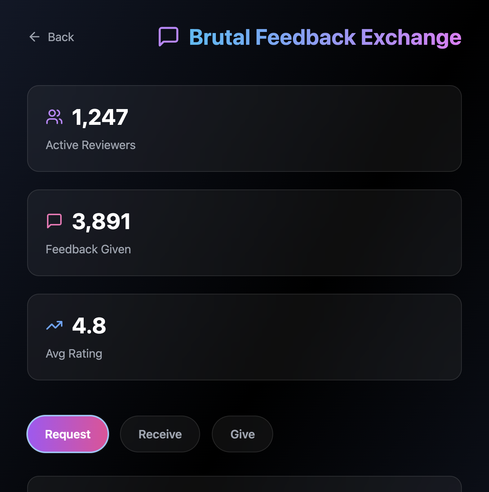
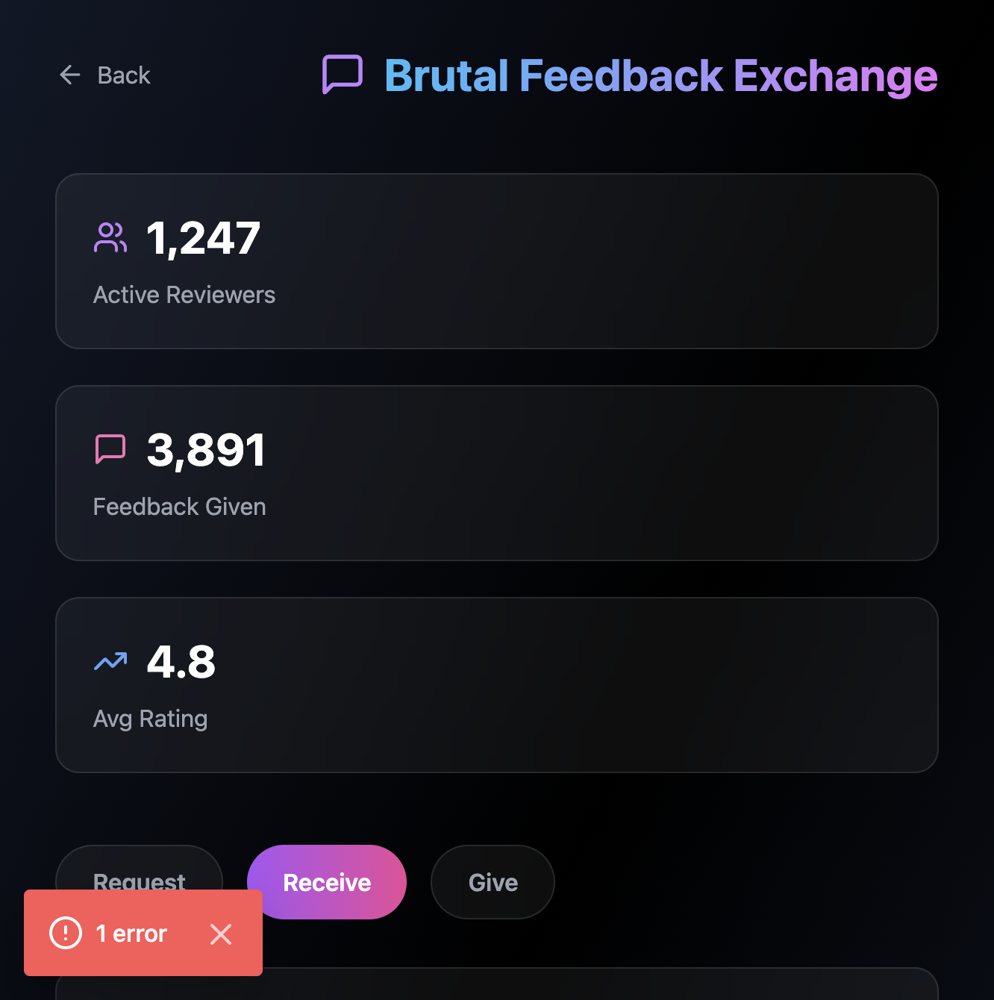

# 💬 Brutal Feedback Exchange

Get honest, direct feedback from fellow builders. No sugar-coating, just real critiques.

## Overview

A platform where indie hackers can request, receive, and give brutally honest feedback on their projects, landing pages, and ideas. Built for those who value direct, actionable feedback over polite niceties.

## Features

- **Request Feedback** - Submit your project or idea for review
- **Receive Feedback** - Get matched with experienced builders
- **Give Feedback** - Help others by providing honest critiques
- **Rating System** - Rate feedback quality and helpfulness
- **Feedback Types** - Categorized as brutal, constructive, or praise

## How It Works

1. **Request** - Describe what you need feedback on
2. **Match** - Get paired with a reviewer
3. **Review** - Receive honest, direct feedback
4. **Rate** - Help improve the system by rating feedback quality

## Stats Dashboard

- Active Reviewers count
- Total Feedback Given
- Average Rating
- Response time metrics

## Tech Stack

- Next.js 14 App Router
- React 18
- TypeScript
- Tailwind CSS
- Framer Motion

## Usage

Navigate to `/brutal-feedback` to access the tool.

## Contributing

This is part of the Indie Hacker Toolkit. See main README for contribution guidelines.

