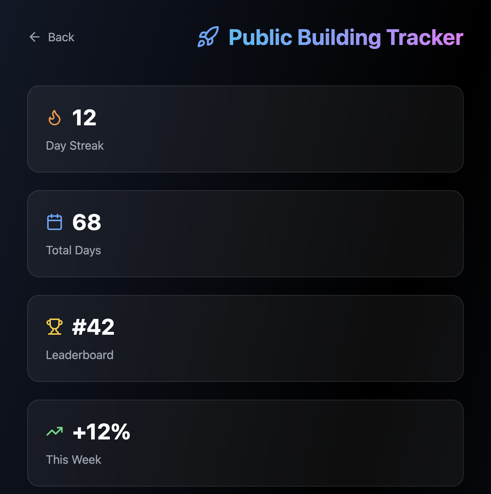

# 🚀 Public Building Tracker

Track your daily progress, build in public, and stay accountable to the community.

## Overview

A gamified progress tracker for indie hackers who want to build in public. Track your daily updates, maintain streaks, and stay accountable to the community.

## Features

- **Daily Updates** - Post what you built each day
- **Streak Tracking** - Maintain your building streak with fire emoji 🔥
- **Project Management** - Track multiple projects simultaneously
- **Leaderboard** - See where you rank among other builders
- **Progress Stats** - Total days, current streak, weekly growth
- **Community Engagement** - Like and interact with other builders' updates

## How It Works

1. **Create Project** - Add a new project you're working on
2. **Daily Updates** - Post what you accomplished each day
3. **Maintain Streak** - Keep building daily to maintain your streak
4. **Track Progress** - See your stats and leaderboard position

## Stats Dashboard

- **Day Streak** - Current consecutive days of building
- **Total Days** - Total days you've been building
- **Leaderboard** - Your rank among all builders
- **Weekly Growth** - Percentage growth this week

## Gamification

- 🔥 Streak system encourages daily building
- 🏆 Leaderboard creates friendly competition
- 📈 Progress tracking motivates continued work
- 💪 Community accountability keeps you going

## Project States

- **Building** - Actively in development
- **Shipped** - Successfully launched
- **Paused** - Temporarily on hold

## Tech Stack

- Next.js 14 App Router
- React 18
- TypeScript
- Tailwind CSS
- Framer Motion

## Usage

Navigate to `/building-tracker` to access the tool.

## Contributing

This is part of the Indie Hacker Toolkit. See main README for contribution guidelines.

