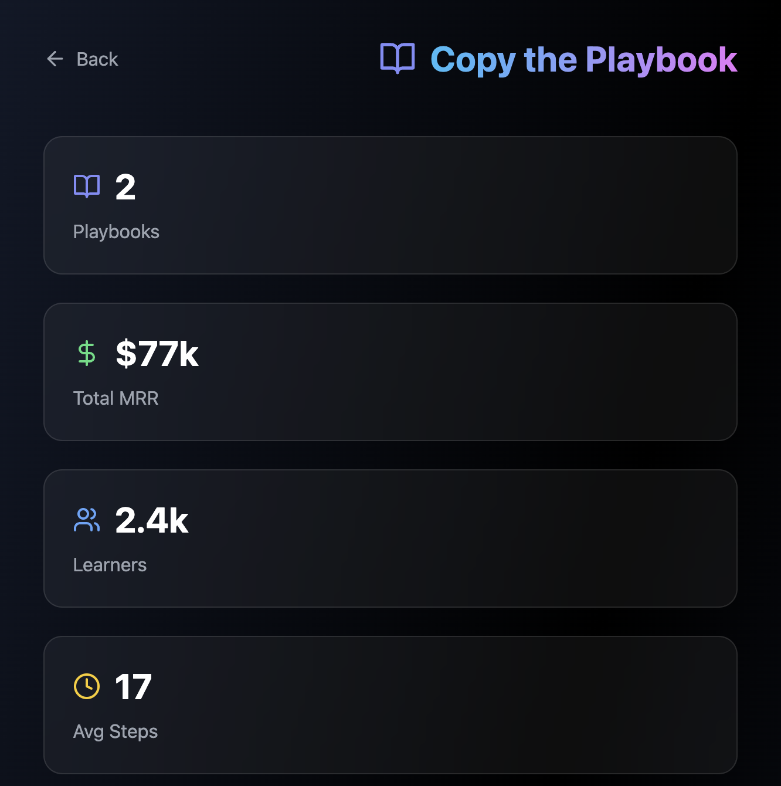

# 📚 Copy the Playbook

Reverse-engineer successful indie products. Learn how they were built, step by step.

## Overview

A collection of step-by-step playbooks that break down how successful indie products were built. Learn from real examples and apply the same strategies to your own projects.

## Features

- **Step-by-Step Guides** - Detailed breakdowns of product journeys
- **Tech Stack Info** - See what technologies were used
- **Timeline Data** - Understand how long each step took
- **Revenue Context** - See revenue at each stage
- **Expandable Details** - Deep dive into each step
- **Multiple Playbooks** - Learn from various successful products

## How It Works

1. **Browse Playbooks** - Explore available product playbooks
2. **Select Product** - Choose a product you want to learn from
3. **Follow Steps** - See exactly how it was built
4. **Apply Learnings** - Use the same strategies for your product

## Stats Dashboard

- **Total Playbooks** - Number of available playbooks
- **Total MRR** - Combined revenue of all playbook products
- **Active Learners** - Community members using playbooks
- **Average Steps** - Mean number of steps per playbook

## Playbook Structure

Each playbook includes:
- Product overview and context
- Step-by-step building process
- Technologies used at each stage
- Time taken for each step
- Key insights and learnings
- Revenue milestones

## Example Playbooks

- **Nomad List** - How a simple spreadsheet became $45k MRR
- **Remote OK** - Building a job board that generates $32k MRR
- More playbooks coming soon...

## Step Details

Each step includes:
- What was built
- Tools and technologies used
- Time investment
- Key insights
- What to avoid

## Tech Stack

- Next.js 14 App Router
- React 18
- TypeScript
- Tailwind CSS
- Framer Motion

## Usage

Navigate to `/copy-playbook` to access the tool.

## Contributing

This is part of the Indie Hacker Toolkit. See main README for contribution guidelines.

