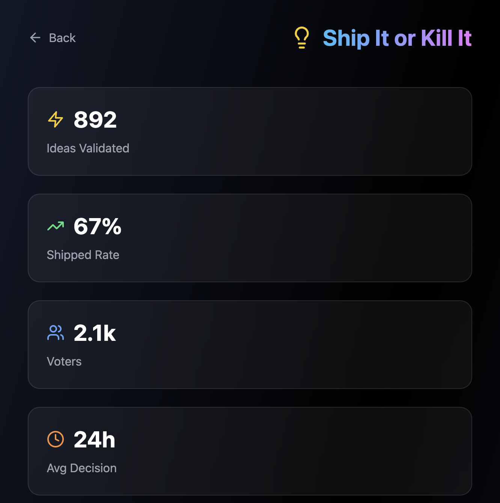

# 💡 Ship It or Kill It

Let the community decide if your idea is worth building. Validate before you code.

## Overview

A community-driven validation platform where you can submit your product ideas and get real-time feedback on whether to build or kill them. Save time by validating ideas before writing a single line of code.

## Features

- **Submit Ideas** - Share your product concept with the community
- **Vote System** - Community votes "Ship It" or "Kill It"
- **Real-time Results** - See vote percentages and community sentiment
- **Trending Ideas** - Discover what the community is excited about
- **Category Filtering** - Filter by product category
- **Decision Timeline** - See how long ideas take to reach consensus

## How It Works

1. **Submit** - Describe your idea and the problem it solves
2. **Vote** - Community members vote Ship It or Kill It
3. **Decide** - Ideas with 70%+ Ship votes are validated
4. **Build** - Only build ideas the community believes in

## Stats Dashboard

- Total Ideas Validated
- Shipped Rate percentage
- Active Voters count
- Average Decision Time

## Vote Thresholds

- **70%+ Ship Votes** = ✅ Build it!
- **30-70% Ship Votes** = ⚠️ Needs refinement
- **<30% Ship Votes** = ❌ Kill it

## Tech Stack

- Next.js 14 App Router
- React 18
- TypeScript
- Tailwind CSS
- Framer Motion

## Usage

Navigate to `/ship-or-kill` to access the tool.

## Contributing

This is part of the Indie Hacker Toolkit. See main README for contribution guidelines.

